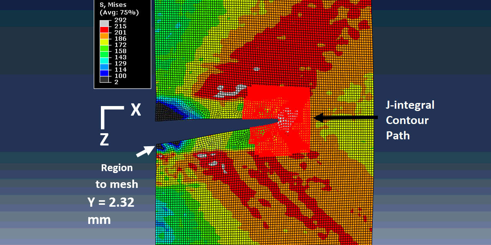

OUR-OMA: Oxford University Reinjection-Optimized Meshing Add-on
===============================================

What is OUR-OMA?
-------------

OUR-OMA employs a finite element approach to extract the J-integral from digital 
image correlation (DIC) and digital volume correlation (DVC) measured displacement fields. 
OUR-OMA has been developed in python and runs inside Abaqus via its scripting interface.

The DIC/DVC measured displacement fields are imported as a set of full field boundary conditions 
into a finite element model of the crack. The location of the crack 
tip and mouth in the displacement field must be known and specified in the code. A region 
around the crack, chosen by the user, is then re-meshed with higher order elements for improved accuracy. 
The user selects another region larger than the first re-meshed area, which is free from boundary conditions, 
to allow for more realistic material response/deformation. The J-integral around the crack is then computed using 
 a user defined number of contours. 
 
More detailed information about the precise implementation can be found in the 
associated journal publication:

Barhli, S. M., Mostafavi, M., Cinar, A. F., Hollis, D., & Marrow, T. J. (2017). J-Integral Calculation by Finite Element Processing of Measured Full-Field Surface Displacements. Experimental Mechanics, 57(6), 997–1009. https://doi.org/10.1007/s11340-017-0275-1. 
<https://doi.org/10.1007/s11340-017-0275-1>

Dependencies
------------

OUR-OMA is coded in Python and runs inside the Abaqus software (preferably Abaqus 6.14 or more recent) 
via its scripting interface. The code requires numpy, which comes pre-built with the Abaqus python scripting API.

Installation
-------------

The file is simply saved into the same directory as the displacement field to be evaluated.
To run enter 'abaqus cae noGUI=filename.py'. The full path must be included in filename.
